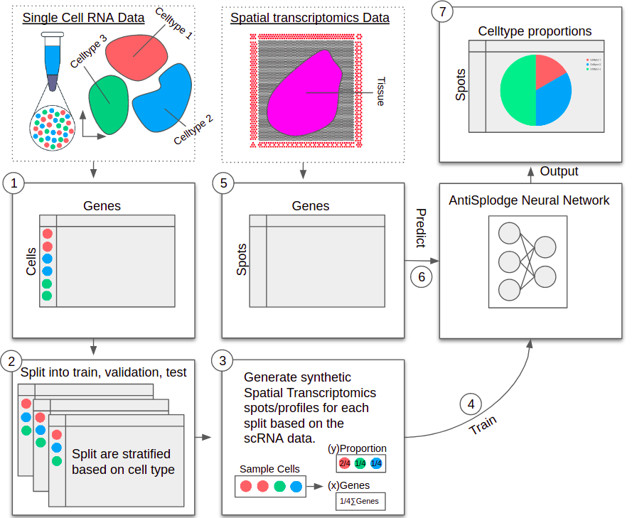

# AntiSplodge  



**AntiSplodge**, is a simple feed-forward neural network-based pipeline, designed to effective deconvolute spatial transcriptomics profiles, in an easy, fast, and, intuitive manner. It comes with all functions required to do a full deconvolution, from sampling synthetic spot profiles required to train the neural network, to the methods required to train the supplied network architecture. It is neatly packed into a python package with function calls similar to that of traditional R-packages, where users are only exposed to fiddling with hyperparameters.

## Installation

### Using pip

You can install the package directy by running the following pip command:

`pip install antisplodge`

You can find the pip page at: https://pypi.org/project/AntiSplodge/

### From GitHuB

You can install the package directly from GitHub by running the following command:

`python -m pip install git+https://github.com/HealthML/AntiSplodge.git`

### Directly from source (this repository)

Clone the repository to a folder of your choice.

From a terminal this can be done by running:

`git clone git@github.com:HealthML/AntiSplodge.git`

Subsequently, run the following pip command from your terminal (in the root of cloned directory):

`pip install .`

## Usage

The full pipeline (see blow) assumes that you have a scRNA dataset (SC) and spatial transcriptomics dataset (ST) that both are formatted as .h5ad (AnnData data structures). Please see https://anndata.readthedocs.io/ for information about how to structure your data. Alternative you can check out the tutorial https://github.com/HealthML/AntiSplodge_Turorial for an example on how to do this.

### Standard full pipeline

```python
import antisplodge as AS
# SC should be the single-cell dataset formatted as .h5ad (AnnData)
Exp = AS.DeconvolutionExperiment(SC) 
Exp.setVerbosity(True)

# CELLTYPE_COLUMN should be replaced with actual column
Exp.setCellTypeColumn('CELLTYPE_COLUMN') 
# Use 80% as train data and split the rest into a 50/50 split validation and testing
Exp.splitTrainTestValidation(train=0.8, rest=0.5)

# Generate profiles, num_profiles = [#training, #validation, #testing]
# This will construct 100.000 training profiles, 10.000 validation profiles, and, 10.000 test profiles
# All profiles will be generated from 10 cell profiles (CD=10)
# for train, validation and test (respectively)
Exp.generateTrainTestValidation(num_profiles=[100000,10000,10000], CD=[10,10])

# Load the profiles into data loaders
Exp.setupDataLoaders()

# Initialize Neural network-model and allocate it to the cuda_id specified
# Use 'cuda_id="cpu"' if you want to allocate it to a cpu
Exp.setupModel(cuda_id=6)
Exp.setupOptimizerAndCriterion(learning_rate = 0.001)

# Train the model using the profiles generated 
# The patience parameter determines how long it will run without fining a new better (lower) error 
# The weights found will be saved to 'NNDeconvolver.pt' and will be autoloaded once the training is complete 
stats = AS.train(Exp, save_file="NNDeconvolver.pt", patience=100)

# print the mean JSD for train, validation, and test
print(AS.getMeanJSD(Exp, "train"), AS.getMeanJSD(Exp, "validation"), AS.getMeanJSD(Exp, "test"))

#
# Afterwards do prediction
#

# Assuming we have a spatial transcriptomics dataset ST formatted in .h5ad (AnnData)
# create dataloader so that we can predict the profiles of each spot in our ST dataset
dataset_spots = AS.SingleCellDataset(torch.from_numpy(np.array(ST.X.toarray())).float(), torch.from_numpy(np.array([0]*ST.n_obs)).float())
spots_loader = DataLoader(dataset=dataset_spots,
                      batch_size=50, # batch_size doesn't matter 
)

spot_preds = AS.predict(Exp, spots_loader) # predict spots
# The results for each ST profile (spot) is now in spot_preds and can be used for further analysis 
```

### Order of execution

1. **Start an experiment**: `Exp = AS.DeconvolutionExperiment(SC)` must be the first call. 

2. **Define datasets based on the SC dataset**: `Exp.splitTrainTestValidation(train=0.8, rest=0.5)` must be called before 
`Exp.generateTrainTestValidation(num_profiles=[10000,5000,1000], CD=[1,10])`.

3. **Setup model and optimizers**: `Exp.setupModel(cuda_id=6)` must be called before 
`Exp.setupOptimizerAndCriterion(learning_rate = 0.001)`. Each time `setupModel` is called, `Exp.setupOptimizerAndCriterion` must be called again, as optimizers and criterions are bound to the model, for use during training. 

4. **Train the model**: `stats = AS.train(Exp, save_file="NNDeconvolver.pt", patience=100)`.

4. **Predict spots using the model**: `spot_preds = AS.predict(Exp, spots_loader)`.

The order of execution must be in the order listed above. 

## Useful snippets

### Several ways of training 

**1. Standard training**

The standard training procedure.
```python
# Assuming an Exp is an DeconvolutionExperiment
AS.train(experiment=Exp, patience=25, save_file=None, auto_load_model_on_finish=True) # default parameters
```
**2. Several warm restarts**

Do 10 warm restarts with a low patience (n=5), this will autoload the model per train call.
This will make the best model weights be loaded back onto the model and it will try again from these settings
```python
best_error = None
# Do 10 warm restarts 
for i in range(10):
    AS.train(experiment=Exp, patience=5, best_loss=best_error)
    best_error = np.min(stats['validation_loss'])
```

**3. Lowering learning rate**

Start with a high learning rate and lower this by half for each warm restart.
```python
lr = 0.01
all_stats = []
best_error = None

# do 5 warm restarts with decreasing learning rate
for i in range(5):
    print("Training with learning rate:", lr)
    Exp.setupOptimizerAndCriterion(learning_rate=lr)
    lr /= 10 # reduce learning rate by a factor of 10
    
    # For longer training, increase patience threshold
    stats = AS.train(Exp, save_file="NNDeconvolver.pt", patience=25, best_loss=best_error) 
    all_stats.extend(stats)
    
    best_error = np.min(stats['validation_loss']) # set best error as the target error to beat
    # the results in stats is the training errors during in each epoch (which might be needed for training plots)
```

**4. Running on systems with reduced memory using smaller sets of training data**

For users having trouble with the memory footprint of the profile generation, it is possible to generate smaller sets of training and validation profiles. 
```python
Exp.splitTrainTestValidation(train=0.8, rest=0.5) # define the dataset splits
Exp.setupModel(cuda_id=6) # the model can be built beforehand
best_error = None

# do 100 warm restarts with smaller chunks of training data
for i in range(100):
    Exp.generateTrainTestValidation(num_profiles=[5000,1000,1], CD=[1,10])
    Exp.setupDataLoaders()
    AS.train(experiment=Exp, save_file="CurrentDeconvolver.pt", patience=10, best_loss=best_error)
    
    best_error = np.min(stats['validation_loss']) 

# Remember to generate test profiles after training is complete 
Exp.generateTrainTestValidation(num_profiles=[1,1,1000], CD=[1,10])

# Continue as usual
```

### Tutorial
Check out the tutorial located at: https://github.com/HealthML/AntiSplodge_Turorial. This will give you a full tour from preprocessing to deconvoluting by predicting cell type proportions of the spatial transcriptomics spots.

## Dependencies

The list of dependencies are:

- numpy>=1.17.2 (https://numpy.org/)
- pandas>=0.25.3 (https://pandas.pydata.org/)
- scikit-learn>=0.22.1 (https://scikit-learn.org/)
- torch>=1.9.0 (https://pytorch.org/)
- scipy>=1.4.1 (https://www.scipy.org/)


## Documentation

The documentation is available at: https://antisplodge.readthedocs.io/.

## References

Coming soon.

## License

The source code for AntiSplodge is licensed under the MIT License. See the [LICENSE](LICENSE) file for details.

## Known issues 

- AntiSplodge is prone to be affected by bad initiations. Oftentimes, this can be resolved by simply restarting the Experiment (or re-initializing the model). This seems to be more frequent when solving problems with many classes (large number of cell types).
